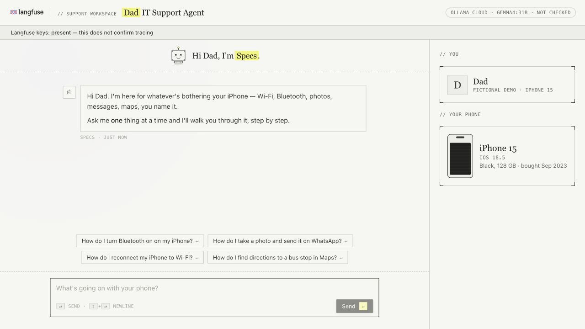
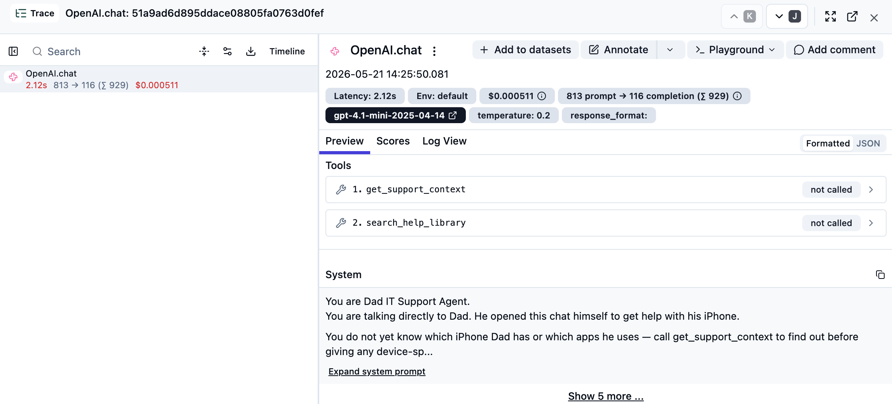
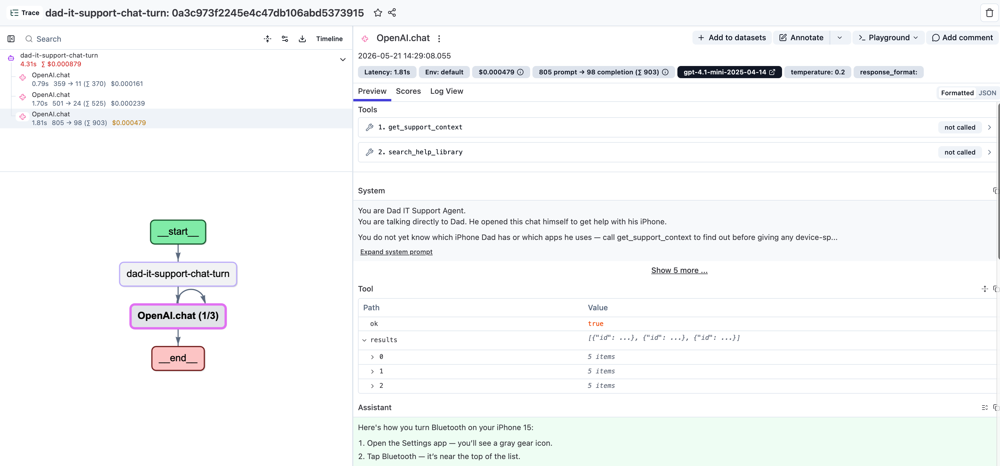
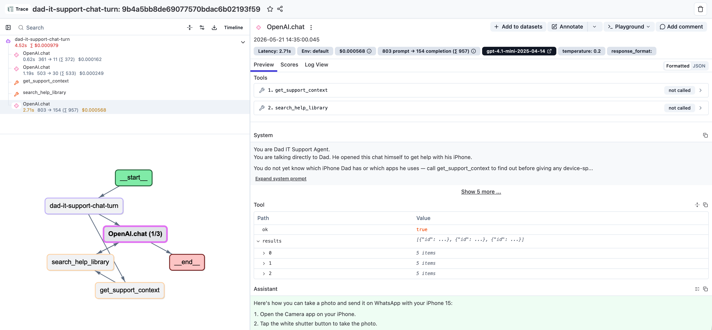

# Implement tracing: student lab

## Starting point and learning goal

The app works with your selected model provider, but **has no tracing implementation**. The packages are already installed so you can concentrate on instrumentation. Project keys alone will not send traces.

Keep the original learning sequence:

1. Record model generations.
2. Group them under one agent observation per turn.
3. Record the actual tool executions as children.

You will edit `workshop/src/server/index.ts`, `support-agent.ts`, and `tools.ts`. The code blocks below are changes for you to apply, not changes already present. They follow the original workshop's guided implementation format. Keep the provider settings, request timeout, tool behavior, and shutdown logic intact.

**Screenshot guide:** The three Langfuse trace screenshots are reference examples from the [original Langfuse learner lesson](https://langfuse.com/workshop/learner/02-tracing), credited to the Langfuse team. Their OpenAI/GPT model names, timings, token counts, and prices are not required results for this Ollama/Duke adaptation. Compare the observation structure and report your own run; missing cost data is not zero cost.

## Before coding: establish the baseline

Complete README setup and run the provider probe. Add your own Langfuse project keys and correct region URL to `workshop/.env`. Start the app and send “How do I turn Bluetooth on on my iPhone?” Confirm it answers. **No Langfuse trace is expected at this point**, even with valid project keys.

Use fictional questions. After you add tracing, prompts, answers, and tool results will be sent to your Langfuse project.



Local Ollama app: check the selected provider/model, greeting, question buttons, and iPhone panel. “Keys present” only describes configuration; it does not confirm trace delivery.

## Step 1 — Record model generations

### A. Start the exporter in `workshop/src/server/index.ts`

Keep `import "./load-env";` first. Add these imports beside the other imports:

```ts
import { NodeSDK } from "@opentelemetry/sdk-node";
import { LangfuseSpanProcessor } from "@langfuse/otel";
```

Replace the `// Tracing exercise: initialize...` comment above `const instanceId` with:

```ts
const langfuseSpanProcessor = isLangfuseConfigured() ? new LangfuseSpanProcessor({
  publicKey: env.langfusePublicKey, secretKey: env.langfuseSecretKey, baseUrl: env.langfuseBaseUrl
}) : undefined;
const sdk = langfuseSpanProcessor ? new NodeSDK({ spanProcessors: [langfuseSpanProcessor] }) : undefined;
sdk?.start();
```

The exporter starts only when both project keys are populated. Those keys must be valid and match the configured region for delivery to succeed. `env` and `isLangfuseConfigured` are already imported.

Inside the existing `shutdown()` function, replace the `// Tracing exercise: flush...` comment, after the awaited `server.close(...)`, with:

```ts
await langfuseSpanProcessor?.forceFlush();
await sdk?.shutdown();
```

Keep the surrounding cancellation, watchdog, try/catch, and signal handlers. Do not add a second shutdown handler. This lets pending observations flush on a normal restart.

### B. Wrap the model client in `workshop/src/server/support-agent.ts`

Add:

```ts
import { observeOpenAI } from "@langfuse/openai";
```

Find `const openai = new OpenAI(...)` inside `runSupportConversation`. Replace that declaration with:

```ts
const openai = observeOpenAI(new OpenAI({ apiKey: env.openaiApiKey, baseURL: env.openaiBaseUrl, timeout: env.chatTimeoutMs, maxRetries: 0 }));
```

The OpenAI-compatible client still calls your selected provider. The wrapper records its requests and responses; it does not switch the model provider. Preserve `baseURL`, `timeout`, `maxRetries`, and the `{ signal }` options on the model request below.

### Check step 1

Save the files, then run:

```text
uv run lab.py check
uv run lab.py restart
```

Send a **new** Bluetooth question through the app. Wait briefly, then refresh your Langfuse project's recent traces. Look for model generation observations with prompts, responses, durations, and usage when reported. At this stage generations are not yet grouped under a single agent parent. The command-line provider probe intentionally does not create traces.



Step 1 — a model generation appears on its own. Inspect its input, output, latency, and reported usage. Tools listed in the generation panel are not separate observations of tool execution. Screenshot credit: Langfuse workshop.

## Step 2 — Group generations under one agent turn

In `workshop/src/server/support-agent.ts`, add:

```ts
import { observe } from "@langfuse/tracing";
```

Find the exported function declaration:

```ts
export async function runSupportConversation(request: ChatRequest): Promise<ChatResponse> {
```

Replace only that declaration with:

```ts
async function runSupportConversationInner(request: ChatRequest): Promise<ChatResponse> {
```

Keep its entire body. At the bottom of the file, after the function's closing brace, add:

```ts
export const runSupportConversation = observe(runSupportConversationInner, {
  name: "dad-it-support-chat-turn",
  asType: "agent"
});
```

The server continues importing `runSupportConversation` as before. Its argument becomes the agent input and its return value becomes the output.

**Check:** run `check`, restart, and ask a fresh question. Find the matching `dad-it-support-chat-turn` trace. Model generations should now be children of one AGENT observation. Merely seeing a tool request in a model response does not yet mean the actual tool execution has its own observation.



Step 2 — dad-it-support-chat-turn groups the generations under one agent parent. The left trace tree does not yet contain separate tool observations. Screenshot credit: Langfuse workshop.

## Step 3 — Record tool executions

In `workshop/src/server/tools.ts`, add:

```ts
import { observe } from "@langfuse/tracing";
```

Keep `TOOL_DEFINITIONS` unchanged. Add these two observed helpers immediately before `export async function executeTool`:

```ts
const getSupportContextTool = observe(
  async () => {
      const context = getSupportContext();
      return {
        ok: true,
        context: {
          id: context.id,
          label: context.label,
          devices: context.devices,
          deviceSummary: context.deviceSummary,
          responseStyle: context.responseStyle,
          scopeHighlights: context.scopeHighlights,
          notableApps: context.notableApps
        }
      };
  },
  { name: "get_support_context", asType: "tool" }
);

const searchHelpLibraryTool = observe(
  async (input: { question: string }) => {
      const guides = searchGuides(input.question);
      return {
        ok: true,
        results: guides.map((guide) => ({
          id: guide.id,
          title: guide.title,
          summary: guide.summary,
          steps: guide.steps,
          caution: guide.caution ?? null
        }))
      };
  },
  { name: "search_help_library", asType: "tool" }
);
```

Replace the existing `executeTool` function with this dispatch function so calls go through your new wrappers:

```ts
export async function executeTool(name: string, input: Record<string, unknown>): Promise<ToolResult> {
  switch (name) {
    case "get_support_context":
      return getSupportContextTool();
    case "search_help_library":
      return searchHelpLibraryTool({ question: String(input.question ?? "") });
    default:
      return { ok: false, error: `Unsupported tool: ${name}` };
  }
}
```

Notice that the device profile and guide results are unchanged. The wrappers add observations around the work the tools were already doing.

## Verify the completed implementation

Run `check`, restart, and send a new Bluetooth question. In Langfuse, match its time and question, then expand the trace:

- One AGENT parent named `dad-it-support-chat-turn`.
- GENERATION children showing model requests and responses.
- TOOL children named `get_support_context` and `search_help_library`, showing their results.
- The agent input contains the chat request; its output contains the answer.

Generation counts can vary. A model may choose tools inconsistently; distinguish that behavior from missing instrumentation. The header reports model request status and whether project keys are present. Only the matching trace in Langfuse confirms delivery.



Step 3 — the left trace tree contains the agent, model generations, get_support_context, and search_help_library. Select a TOOL observation to inspect its actual results. This upstream example uses a WhatsApp question; your question and generation count may differ. Screenshot credit: Langfuse workshop.

## Explain what you built

Using your instructor's submission format, report:

1. Selected provider/model and whether setup/probe passed.
2. The three source changes that enabled generations, the agent parent, and tools.
3. One question/answer and a screenshot of the expanded trace, with no credentials.
4. Evidence that the final answer used the device context and help guide.
5. The slowest observed step and token usage where available. Missing cost data is not zero cost.
6. Any setup or model-behavior problems you encountered.

Try a WhatsApp or Wi-Fi question and compare its tool result with the Bluetooth trace. Provider comparison is optional and should use a fresh conversation and the same question.

## Troubleshooting

- Before implementation, no traces is the correct baseline.
- Generations absent after step 1: check the exporter, `observeOpenAI`, project keys, region, and server logs.
- Generations appear separately after step 2: ensure the exported `runSupportConversation` is the observed wrapper and the loop remains inside `runSupportConversationInner`.
- Tool calls are visible in model output but no TOOL observations appear: ensure `executeTool` actually invokes your observed helpers.
- Restart after `.env` edits. Send a new app request after each coding step; the connection probe remains untraced.
- Keep optional JSON testing separate from this exercise.

This completes the tracing lesson. Later upstream prompt-management, monitoring, dataset, and evaluation modules remain separate lessons selected by the instructor. Do not switch upstream Git checkpoints in this bundled adaptation: they do not contain its provider changes.
